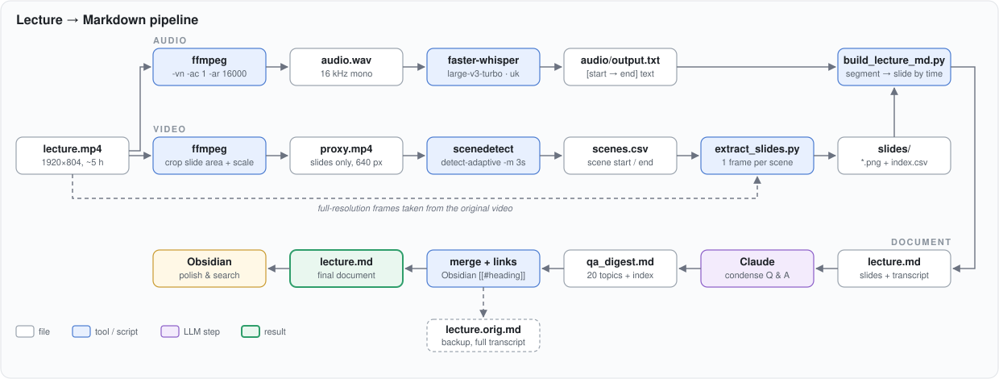

# Lecture → Markdown: transcription and slide extraction process

How a long recorded lecture (≈5 h, 1920×804, Ukrainian) is turned into a single searchable Markdown document for Obsidian: slide images, the transcript mapped to each slide, and a condensed Q & A digest. Everything uses open-source tools and runs locally.

First run: *Harness Engineering, part 1* (`Harness_Engineering/`).

## Pipeline at a glance



## Tools

| Tool | Purpose |
|------|---------|
| `ffmpeg` / `ffprobe` | audio extraction, cropping, proxy video, frame grabs |
| `whisper-ctranslate2` (faster-whisper) | speech-to-text, installed in `.venv` |
| `scenedetect` (PySceneDetect) | slide-change detection, installed in `.venv` |
| `extract_slides.py` | one image per scene from the full-quality video |
| `build_lecture_md.py` | maps transcript segments to slides → `lecture.md` |
| `imagehash`, `pillow` (optional) | near-duplicate slide removal (`--dedup`) |
| Claude | Q & A digest, merge, Obsidian link conversion |

## Automation

All scripts, the Docker image and the agent skill now live in `process/`, see [README.md](README.md).
`scripts/lecture.sh` runs steps 1–7 below (`probe`, `audio`, `transcribe`, `proxy`, `scenes`, `slides`, `build`, or `all`).
The LLM steps 8–10 and the topic notes are described in `skills/lecture-to-notes/SKILL.md`.
`scripts/check_links.py` verifies the Obsidian links.

## Folder layout (per lecture)

New lectures processed with `lecture.sh` get one work folder per video:

```
LLM/
├── process/                    scripts, Dockerfile, skill (see README.md)
└── Course/
    ├── lecture.mp4             the source video
    └── lecture/                work folder (lecture.sh -o to change)
        ├── probe.png, check.png   frame grabs for measuring the crop
        ├── audio.wav           16 kHz mono audio
        ├── transcript.txt      "[start → end]  text" per line
        ├── proxy.mp4           cropped, downscaled video for scene detection
        ├── scenes.csv          scene list
        ├── slides/             slide images + index.csv
        ├── lecture.md          final document (+ lecture.orig.md backup after the Q & A merge)
        ├── qa_digest.md        condensed Q & A
        └── lecture_topics.md   topic notes with references
```

The first two courses (`Harness_Engineering/`, `Agentic_Engineering/`) were done by hand and keep their original layout:
`audio/output.txt` or `audio1.txt`, `scenes/`, `slides/` or `part1/`, and the per-lecture `run.sh`, `build*.sh` and `slides*.sh` records of the exact parameters used.

## Steps

### 1. Measure the video layout

Grab a frame and check where the slides and the speaker overlay sit:

```bash
ffprobe -v error -show_entries stream=width,height -of csv=p=0 lecture.mp4
ffmpeg -ss 600 -i lecture.mp4 -frames:v 1 probe.png
```

For this recording: frame 1920×804, slides (the desktop share) at **x = 342…1580**, speaker overlay in a corner outside that area.

Check a crop before encoding hours of video:

```bash
ffmpeg -ss 600 -i lecture.mp4 -vf "crop=1238:804:342:0" -frames:v 1 check.png
```

### 2. Extract audio

```bash
ffmpeg -i lecture.mp4 -vn -ac 1 -ar 16000 audio.wav
```

### 3. Transcribe (`audio/run.sh`)

```bash
whisper-ctranslate2 ../audio.wav --model large-v3-turbo --language Ukrainian \
  --output_format all --vad_filter True --condition_on_previous_text False \
  --initial_prompt "Лекція про Harness в агентах типу Codex, Claude Code, Pi"
```

The segments are saved to `audio/output.txt` in the form `[     0.0 →     22.6]  text`.

Notes:

- **Set `--language` explicitly.** Auto-detection only looks at the first 30 s and often confuses Ukrainian and Russian.
- **`--initial_prompt`** in the lecture's language, listing the English terms, keeps those terms in Latin script instead of transliterated Cyrillic.
- **`--condition_on_previous_text False`** prevents language drift and repetition loops on long files.
- **`--vad_filter True`** skips silence and reduces hallucinated text.
- `large-v3-turbo` is fast and good for transcription, but can't translate. Use `large-v3` if you need `--task translate` (to English).
- Mixed-language speech (Russian questions in a Ukrainian lecture) is transcribed as spoken. For per-segment language detection, use the faster-whisper Python API with `multilingual=True`.

### 4. Build a proxy video for scene detection (`crop.sh`)

Crop to the slide area so speaker movement doesn't count as a slide change, and downscale so detection is fast:

```bash
ffmpeg -i lecture.mp4 -an \
  -vf "crop=1238:804:342:0,scale=640:-2" \
  -c:v h264_videotoolbox -b:v 5M proxy.mp4
```

- `crop=w:h:x:y` — width 1580 − 342 = 1238, full height, offset x = 342.
- `scale=640:-2` keeps the aspect ratio with an even height.
- `h264_videotoolbox` is the macOS hardware encoder and uses `-b:v`; `-crf` applies only to `libx264`.
- Cropping doesn't change the timeline, so proxy timestamps match the original.
- If the overlay overlaps the slide area, black it out after cropping: `drawbox=x=…:y=…:w=…:h=…:color=black:t=fill`.
- If the end of the lecture is a Q & A without slides, the proxy can stop where the slides end (`-t <seconds>`). Here, `proxy2.mp4` covers 0:00–3:52:37.

`scripts/lecture.sh proxy -c W:H:X:Y [-b box] [-e end]` is the reusable version. It picks `h264_videotoolbox` on macOS, `h264_vaapi` when `/dev/dri` is available, and `libx264` otherwise.

### 5. Detect slide changes (`scenes/run.sh`)

```bash
scenedetect -i ../proxy2.mp4 -m 3s detect-adaptive list-scenes -f scenes.csv
```

- `detect-adaptive` handles gradual changes and animations better than `detect-content`.
- `-m 3s` (minimum scene length) stops fades and quick flicks from counting as separate slides.

Result for this lecture: 157 scenes.

### 6. Extract slide images

```bash
python3 ../process/scripts/extract_slides.py lecture.mp4 scenes/scenes.csv -o slides
```

- Grabs one full-resolution frame per scene from the **original** video, cropped to the slide area (default `--crop 1238:804:342:0`).
- `--pick end` (default) takes the frame 1 s before the scene ends, so slides that build up bullet by bullet are captured complete. Other options: `middle`, `start`.
- Files are named with the scene start time: `0002_00h07m00s.png`. `slides/index.csv` stores slide, scene, file, `start_s`, `end_s`, `frame_s`.
- Options: `--dedup 6` (moves near-duplicates to `slides/_dupes/`, needs `imagehash`), `--min-len 5`, `--format jpg`, `--jobs 8`.
- Takes about 16 s for 157 slides.

### 7. Map the transcript to slides

```bash
python3 ../process/scripts/build_lecture_md.py audio/output.txt slides/index.csv -o lecture.md \
  --title "Harness Engineering, частина 1: Харнес зсередини" --timestamps --obsidian
```

- `--obsidian` writes Obsidian heading links (`[[#Slide 2|…]]`) directly, see step 10. Without it, the script writes HTML anchors with `[text](#slide-2)` links, which work in GitHub or VS Code preview.
- Each segment goes to the slide on screen at the segment's midpoint. A slide lasts from its start until the next slide starts.
- Segments are grouped into paragraphs at pauses (`--pause 2.0`) or at a length limit (`--max-chars 700`). `--timestamps` adds `[hh:mm:ss]` before each paragraph.
- Speech after the last slide goes into a **Q & A** section (`--tail-title`), split into 5-minute sub-sections (`--tail-split 300`, `0` = no split).
- The document starts with a contents list: slide number, time, and the first words spoken.

### 8. Condense the Q & A (LLM step)

The Q & A section (~1 h, ~49 k characters) was condensed by Claude into `qa_digest.md`:

- 20 topics, each with the question in 1–2 lines, the answer as bullet points, and key terms.
- A table at the top: number, time, topic, keywords.
- Written in the lecture's language (Ukrainian) so it can be searched with the same words as the transcript.
- Names that Whisper probably misheard are kept but marked *(за транскриптом)* for checking against the video.

To reproduce with another LLM: extract the segments after the last slide as `h:mm:ss text` lines and ask for a topic-by-topic digest in this format.

### 9. Merge into one document

- Back up the full version: `lecture.md` → `lecture.orig.md`.
- Replace everything from the Q & A heading to the end of `lecture.md` with the digest (title dropped, headings demoted one level).

### 10. Make links Obsidian-compatible

Obsidian doesn't follow HTML anchors (`<a id="slide-2">` + `[text](#slide-2)`), so internal links must be heading links. `build_lecture_md.py --obsidian` produces them for the slides and the Q & A entry; for the first lecture the whole document, digest included, was converted after the merge:

- `[[#Slide 2|Slide 2 · 00:07:00]]`
- inside tables, `\|` is used instead of `|` so the cell doesn't split: `[[#1. Агенти для …\|Агенти для …]]`

Heading rules that keep links reliable:

- No colons in headings: time ranges moved to an italic line under the heading (`*00:07:00–00:10:51*`), and `Oracle:` became `Oracle —`.
- No `` ` ``, `*`, `#`, `|`, `^`, `[`, `]` in headings.
- Headings must be unique.

## Lessons learned

- Crop to the slide area **before** scene detection. It removes most false slide changes caused by the speaker overlay.
- Use a small proxy for detection and the original for images: fast detection, full-quality slides.
- Check that the proxy's duration matches what you expect (`ffprobe -show_entries format=duration`). A shorter proxy silently leaves the rest of the lecture without slides.
- Set the Whisper language and an initial prompt with domain terms. Turn off `condition_on_previous_text` for long recordings.
- The `[start → end]` transcript plus `index.csv` timestamps are all that's needed to align speech with slides.

## To do

- ~~Add an `--obsidian` option to `build_lecture_md.py`~~ — done.
- ~~Apply the same process to `Agentic_Engineering`~~ — done, including topic notes for all four lecture files.
- ~~One driver script, Docker image, agent skill~~ — done: `process/`.
- Save the Q & A merge step (9) as a script. For now it is a skill step.
- Optional CUDA variant of the image for NVIDIA hosts (faster-whisper on GPU).
